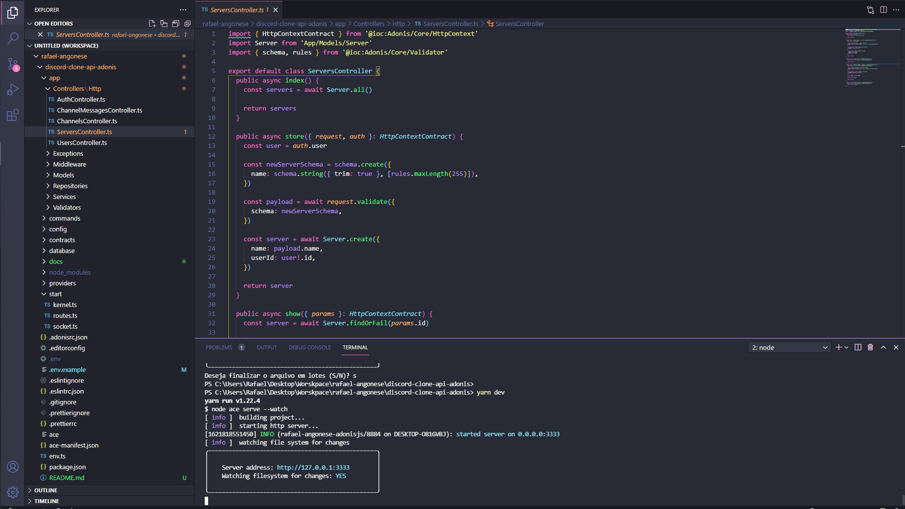

<p align="center">
  
</p>

## ✨ Tecnologias

Esse projeto foi desenvolvido com as seguintes tecnologias:

- [Adonisjs v5](https://adonisjs.com)
- [Postgresql](https://www.postgresql.org/)
- [Socket-io](https://socket.io/)
- [TypeScript](https://www.typescriptlang.org/)

## 💻 Projeto

Este projeto é uma API que fornece informações para um frontend ele tem como objetivo aplicar algumas tecnologias de forma prática.

Funcionalidades:
  - CRUDs.
  - Autenticação.
  - Realtime.

  ## Ambiente de desenvolvimento

```bash
node --version
v16.0.0

yarn --version
1.22.4
```

## 🚀 Como executar

- Clone o repositório
- Instale as dependências com `yarn`
```bash
yarn install
```
- Execute as migrations
```bash
node ace migration:run
```
- Inicie o servidor com `yarn`
```bash
yarn dev
```
- A aplicação pode ser acessada em [`localhost:3333`](http://localhost:3333).
- Você pode verificar uma pequena documentação das rotas da API através da collection exportada via Postman, os arquivos da collection estão na pasta ./docs

## 📄 Licença

Esse projeto está sob a licença MIT. Veja o arquivo [LICENSE](LICENSE.md) para mais detalhes.

---

Feito com ♥ by Rafael Angonese
